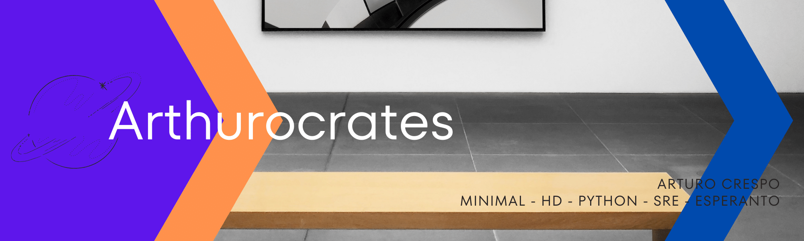

# Pri mi
----

  

## En redes sociales
----

  

## Ultimas Publicaciones
----
<!-- BLOG-POST-LIST:START -->
- [Analisis de sentimientos con NLP Azure](https://diogeneshoy.com/humanidades-digitales/analisis-de-sentimientos-con-nlp-azure/)
<!-- BLOG-POST-LIST:END -->

## Github Stats
----

## Estoy Aprendiendo

- Python

## Preguntame Sobre

- Humanidades Digitales

## Datos divertidos

- Soy filosofo :-D
- Hablo Esperanto

